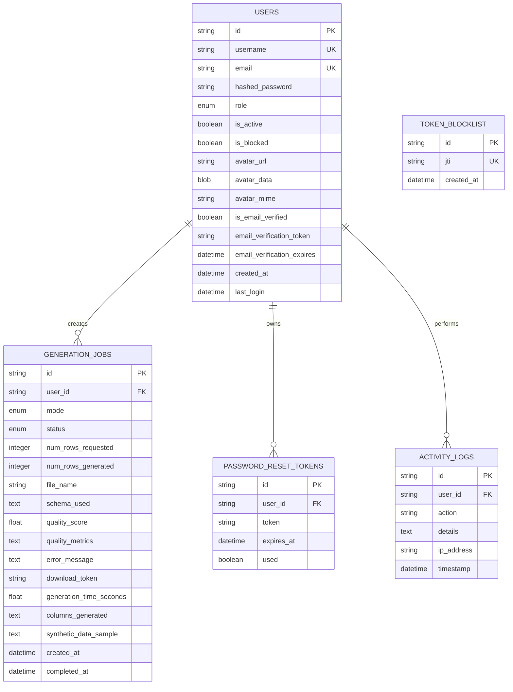

# Database Schema

This document describes the SQLAlchemy ORM schema for the Synthetic Data Generator backend. The runtime models live in `backend/models.py`, and migrations live in `backend/alembic/versions/`.

## Entity Relationship Diagram



## ORM Classes

### `User`

Represents a registered platform account.

Table: `users`

Columns:

| Column | Type | Constraints | Purpose |
| --- | --- | --- | --- |
| `id` | `String(36)` | Primary key | UUID user identifier |
| `username` | `String(30)` | Required, unique, indexed | Display/login username |
| `email` | `String(255)` | Required, unique, indexed | Lower-cased account email |
| `hashed_password` | `String(255)` | Required | Password hash |
| `role` | `Enum(UserRole)` | Required, default `USER` | Authorization role |
| `is_active` | `Boolean` | Default `True` | Account activation flag |
| `is_blocked` | `Boolean` | Default `False` | Admin block flag |
| `avatar_url` | `String(500)` | Optional | External avatar URL fallback |
| `avatar_data` | `LargeBinary` | Optional | Uploaded avatar bytes |
| `avatar_mime` | `String(50)` | Optional | Uploaded avatar content type |
| `is_email_verified` | `Boolean` | Default `False` | Email verification status |
| `email_verification_token` | `String(255)` | Optional | Pending verification token |
| `email_verification_expires` | `DateTime` | Optional | Verification expiry |
| `created_at` | `DateTime` | Required | Account creation timestamp |
| `last_login` | `DateTime` | Optional | Last successful login |

Relationships:

| Relationship | Target | Cardinality | Delete behavior |
| --- | --- | --- | --- |
| `jobs` | `GenerationJob` | One-to-many | Delete user deletes jobs through ORM cascade |
| `reset_tokens` | `PasswordResetToken` | One-to-many | Delete user deletes reset tokens |
| `activity_logs` | `ActivityLog` | One-to-many | Database can set `user_id` to null |

### `GenerationJob`

Tracks every CTGAN or Mimesis synthetic data request.

Table: `generation_jobs`

Columns:

| Column | Type | Constraints | Purpose |
| --- | --- | --- | --- |
| `id` | `String(36)` | Primary key | UUID job identifier |
| `user_id` | `String(36)` | Optional foreign key to `users.id`, indexed through queries | Owner; null allows anonymous jobs |
| `mode` | `Enum(GenerationMode)` | Required | `ctgan` or `mimesis` |
| `status` | `Enum(JobStatus)` | Required, default `PENDING` | Lifecycle status |
| `num_rows_requested` | `Integer` | Required, default `0` | Requested synthetic rows |
| `num_rows_generated` | `Integer` | Optional | Actual generated rows |
| `file_name` | `String(255)` | Optional | Uploaded CTGAN source file name |
| `schema_used` | `Text` | Optional JSON | Mimesis schema request |
| `quality_score` | `Float` | Optional | Overall quality score from 0 to 100 |
| `quality_metrics` | `Text` | Optional JSON | Detailed quality metrics |
| `error_message` | `Text` | Optional | Failure reason |
| `download_token` | `String(36)` | Optional, indexed | Result download lookup token |
| `generation_time_seconds` | `Float` | Optional | Job runtime |
| `columns_generated` | `Text` | Optional JSON | Generated column names |
| `synthetic_data_sample` | `Text` | Optional JSON | Stored preview/sample rows |
| `created_at` | `DateTime` | Required | Job creation timestamp |
| `completed_at` | `DateTime` | Optional | Job completion/failure timestamp |

Relationships:

| Relationship | Target | Cardinality | Delete behavior |
| --- | --- | --- | --- |
| `user` | `User` | Many-to-one, optional | User deletion removes jobs via ORM cascade in normal app flows |

### `PasswordResetToken`

Stores password reset requests.

Table: `password_reset_tokens`

Columns:

| Column | Type | Constraints | Purpose |
| --- | --- | --- | --- |
| `id` | `String(36)` | Primary key | UUID token row identifier |
| `user_id` | `String(36)` | Required foreign key to `users.id` | Token owner |
| `token` | `String(255)` | Required | Hashed reset token |
| `expires_at` | `DateTime` | Required | Expiry timestamp |
| `used` | `Boolean` | Default `False` | Prevents token reuse |

Relationships:

| Relationship | Target | Cardinality | Delete behavior |
| --- | --- | --- | --- |
| `user` | `User` | Many-to-one | User deletion deletes reset tokens |

### `ActivityLog`

Stores security and product activity used by the admin dashboard.

Table: `activity_logs`

Columns:

| Column | Type | Constraints | Purpose |
| --- | --- | --- | --- |
| `id` | `String(36)` | Primary key | UUID log identifier |
| `user_id` | `String(36)` | Optional foreign key to `users.id` | Actor when known |
| `action` | `String(50)` | Required | Event name |
| `details` | `Text` | Optional JSON | Structured event metadata |
| `ip_address` | `String(45)` | Optional | IPv4/IPv6 address |
| `timestamp` | `DateTime` | Required | Event timestamp |

Relationships:

| Relationship | Target | Cardinality | Delete behavior |
| --- | --- | --- | --- |
| `user` | `User` | Many-to-one, optional | Can keep audit row while nulling deleted user |

### `TokenBlocklist`

Stores invalidated JWT IDs after logout.

Table: `token_blocklist`

Columns:

| Column | Type | Constraints | Purpose |
| --- | --- | --- | --- |
| `id` | `String(36)` | Primary key | UUID row identifier |
| `jti` | `String(36)` | Required, unique, indexed | JWT ID to reject |
| `created_at` | `DateTime` | Required | Blocklist insertion time |

Relationships: none.

## Enumerations

| Enum | Values | Used by |
| --- | --- | --- |
| `GenerationMode` | `ctgan`, `mimesis` | `GenerationJob.mode` |
| `JobStatus` | `pending`, `processing`, `completed`, `failed` | `GenerationJob.status` |
| `UserRole` | `user`, `admin` | `User.role` |

## Relation Summary

| From | To | Cardinality | Foreign key |
| --- | --- | --- | --- |
| `users.id` | `generation_jobs.user_id` | One user to many jobs | Optional owner |
| `users.id` | `password_reset_tokens.user_id` | One user to many reset tokens | Required owner |
| `users.id` | `activity_logs.user_id` | One user to many logs | Optional actor |

## SQL Reference

```sql
CREATE TABLE users (
    id VARCHAR(36) PRIMARY KEY,
    username VARCHAR(30) NOT NULL UNIQUE,
    email VARCHAR(255) NOT NULL UNIQUE,
    hashed_password VARCHAR(255) NOT NULL,
    role VARCHAR(5) NOT NULL,
    is_active BOOLEAN NOT NULL,
    is_blocked BOOLEAN NOT NULL,
    avatar_url VARCHAR(500),
    avatar_data BYTEA,
    avatar_mime VARCHAR(50),
    is_email_verified BOOLEAN NOT NULL,
    email_verification_token VARCHAR(255),
    email_verification_expires TIMESTAMP,
    created_at TIMESTAMP NOT NULL,
    last_login TIMESTAMP
);

CREATE TABLE generation_jobs (
    id VARCHAR(36) PRIMARY KEY,
    user_id VARCHAR(36) REFERENCES users(id) ON DELETE CASCADE,
    mode VARCHAR(7) NOT NULL,
    status VARCHAR(10) NOT NULL,
    num_rows_requested INTEGER NOT NULL,
    num_rows_generated INTEGER,
    file_name VARCHAR(255),
    schema_used TEXT,
    quality_score FLOAT,
    quality_metrics TEXT,
    error_message TEXT,
    download_token VARCHAR(36),
    generation_time_seconds FLOAT,
    columns_generated TEXT,
    synthetic_data_sample TEXT,
    created_at TIMESTAMP NOT NULL,
    completed_at TIMESTAMP
);

CREATE TABLE password_reset_tokens (
    id VARCHAR(36) PRIMARY KEY,
    user_id VARCHAR(36) NOT NULL REFERENCES users(id) ON DELETE CASCADE,
    token VARCHAR(255) NOT NULL,
    expires_at TIMESTAMP NOT NULL,
    used BOOLEAN NOT NULL
);

CREATE TABLE activity_logs (
    id VARCHAR(36) PRIMARY KEY,
    user_id VARCHAR(36) REFERENCES users(id) ON DELETE SET NULL,
    action VARCHAR(50) NOT NULL,
    details TEXT,
    ip_address VARCHAR(45),
    timestamp TIMESTAMP NOT NULL
);

CREATE TABLE token_blocklist (
    id VARCHAR(36) PRIMARY KEY,
    jti VARCHAR(36) NOT NULL UNIQUE,
    created_at TIMESTAMP NOT NULL
);

CREATE UNIQUE INDEX ix_users_username ON users(username);
CREATE UNIQUE INDEX ix_users_email ON users(email);
CREATE INDEX ix_generation_jobs_download_token ON generation_jobs(download_token);
CREATE UNIQUE INDEX ix_token_blocklist_jti ON token_blocklist(jti);
```
